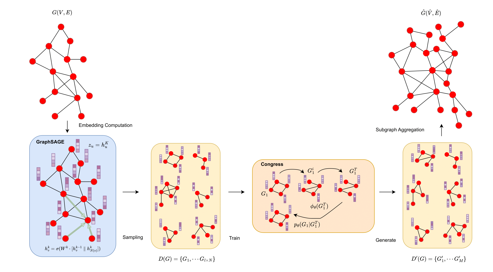
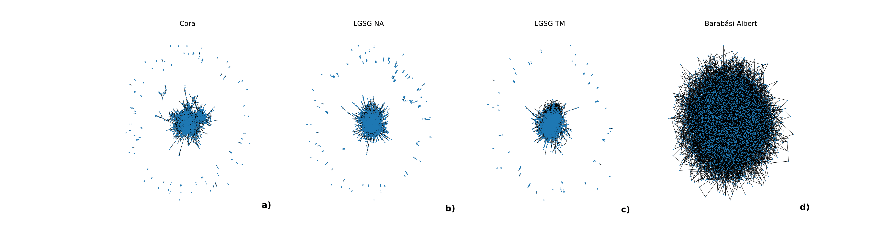

# LGSG (Latent Graph Sampling Generation)

Code for the paper "Generating Large Semi-Synthetic Graphs of Any Size".

This code is built upon the [Digress](https://github.com/cvignac/DiGress) framework, which serves as its foundation.

## Abstract
Graph generation is an important area in network science. Traditional approaches focus on replicating specific properties of real-world graphs, such as small diameters or power-law degree distributions. Recent advancements in deep learning, particularly with Graph Neural Networks, have enabled data-driven methods to learn and generate graphs without relying on predefined structural properties. Despite these advances, current models are limited by their reliance on node IDs, which restricts their ability to generate graphs larger than the input graph and ignores node attributes. To address these challenges, we propose Latent Graph Sampling Generation (LGSG), a novel framework that leverages diffusion models and node embeddings to generate graphs of varying sizes without retraining. The framework eliminates the dependency on node IDs and captures the distribution of node embeddings and subgraph structures, enabling scalable and flexible graph generation. Experimental results show that LGSG performs on par with baseline models for standard metrics while outperforming them in overlooked ones, such as the tendency of nodes to form clusters. Additionally, it maintains consistent structural characteristics across graphs of different sizes, demonstrating robustness and scalability.

## Architecture

## Examples

## Environment installation
This code was tested with PyTorch 2.0.1, cuda 11.8 and torch_geometrics 2.3.1

Setup the conda environment 
- `conda create -n lgsg  python=3.9`
- `conda activate lgsg`
- `conda install -c "nvidia/label/cuda-11.8.0" cuda`
- `pip3 install torch==2.0.1 --index-url https://download.pytorch.org/whl/cu118`
- `pip install -r requirements.txt`

## Run the code
- Launch all of the experiments through `./experiments.sh` 

- Or run only a single experiment `python main.py model=continuous dataset=cora`

- Generate the full-sized graphs using `python nx_graphs.py `

